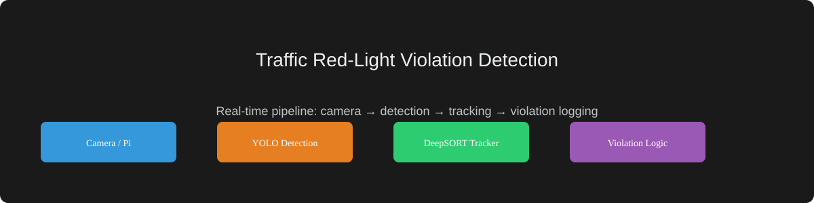
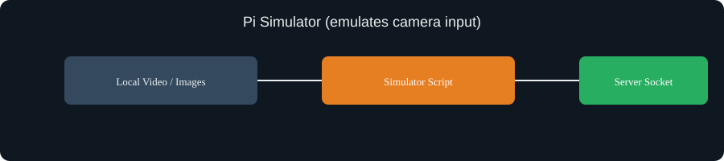
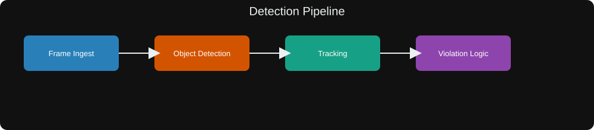
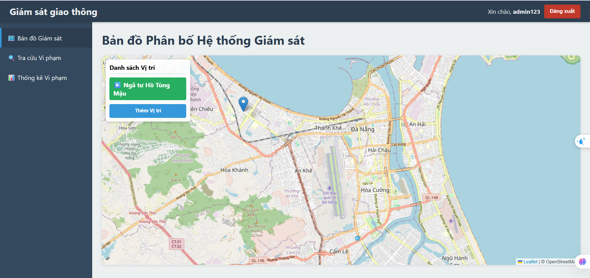
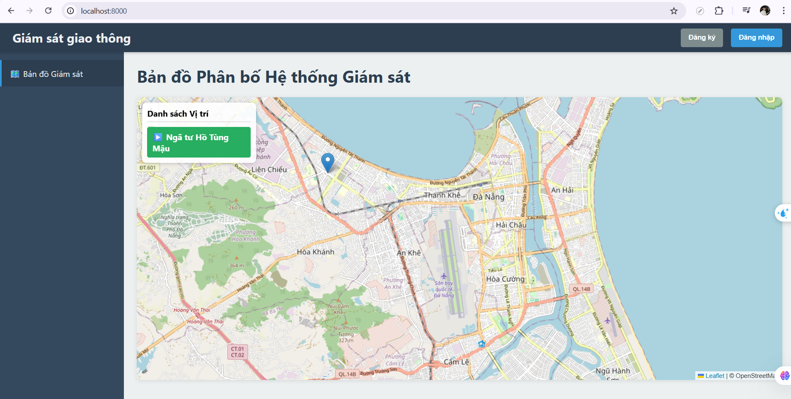
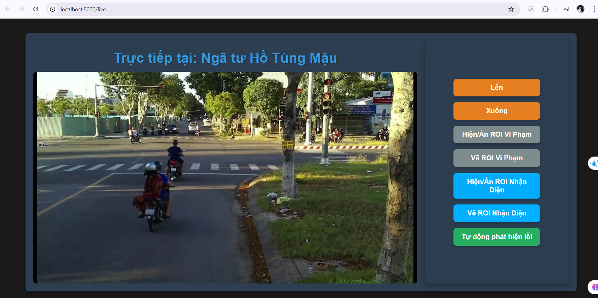
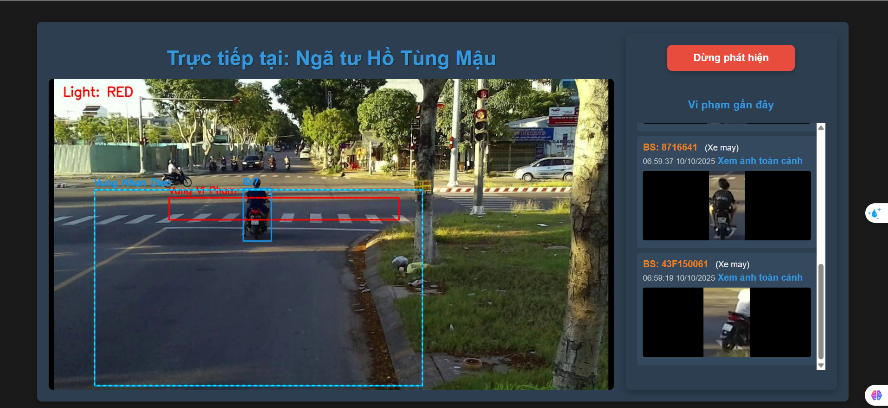
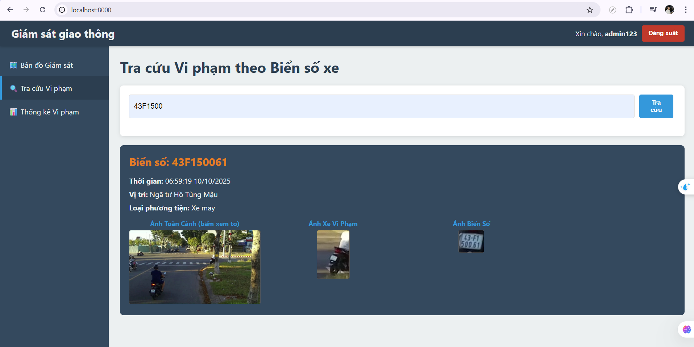
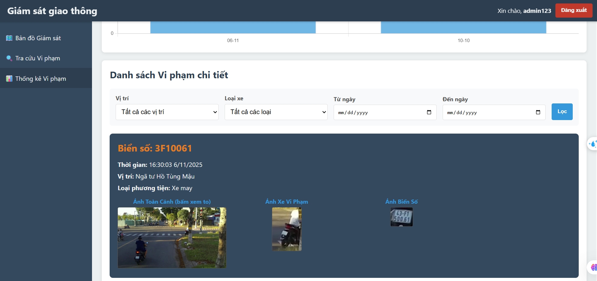

# Traffic Red-Light Violation Detection

A real-time traffic red-light violation detection system. The project receives video frames from cameras (or a Raspberry Pi), detects vehicles and traffic lights, tracks vehicle trajectories, reads license plates, and stores violations (images/videos) with metadata in a PostgreSQL database. The web interface is built with FastAPI and provides live streaming, drawing ROI, and playback of recorded violations.



## Features

- Real-time video processing and streaming via WebSocket
- Vehicle detection (YOLO) and tracking (DeepSORT or equivalent)
- Traffic light state detection (color-based or model-based)
- Direction/movement analysis to filter valid violations
- License plate extraction and recognition (CNN-based) with post-processing
- Store violation images/videos and metadata in PostgreSQL
- Web interface to view live stream, draw ROIs, and review violations

## Repository layout

- `app/` - FastAPI application and backend code
  - `main.py` - application entrypoint and routes
  - `cv_processor.py` - computer vision pipeline (detection, tracking, violation logic)
  - `database.py` - SQLAlchemy engine and session factory
  - `models.py` - ORM models
  - `crud.py` - database helpers
  - `auth.py` - authentication and JWT helpers
- `templates/` - Jinja2 HTML templates for web UI (live, playback, recordings)
- `static/` - static files, generated videos, and violation images
- `runs/` - trained models and weights (YOLO, plate reader, etc.)
- `alembic/` - DB migrations
- `requirements.txt` - Python dependencies

## Requirements

- Python 3.8+
- PostgreSQL (configured in `app/database.py`)
- Packages from `requirements.txt` (install with `pip install -r requirements.txt`)
- (Optional) GPU + CUDA for faster model inference
- (Optional) FFmpeg for video processing

## Quick start

1. Create a Python virtual environment and install dependencies:

```powershell
python -m venv .venv
.\.venv\Scripts\Activate.ps1
pip install -r requirements.txt
```

2. Configure database connection in `app/database.py` (example):

```py
SQLALCHEMY_DATABASE_URL = "postgresql://<user>:<password>@<host>:<port>/<dbname>"
```

3. Initialize the database (choose one):

- Using Alembic (recommended if migrations are present):

```powershell
alembic upgrade head
```

- Or create tables directly (quick dev setup):

```powershell
python -c "from app.database import engine, Base; from app import models; Base.metadata.create_all(bind=engine)"
```

4. Ensure directories exist for storing outputs:

```powershell
mkdir static\videos
mkdir static\violations
```

5. Run the FastAPI server (development):

```powershell
# From the `server` folder
python -m uvicorn app.main:app --host 0.0.0.0 --port 8000 --reload
```

6. Open the web UI:

- Live stream: `http://localhost:8000/live`
- Main page: `http://localhost:8000/`

## Simulator (emulate Raspberry Pi input)

If you don't have a physical Raspberry Pi camera or device sending frames, you can emulate the Pi behavior using the `simulator` folder. The simulator provides a simple script that sends frames or simulated packets to the server in the same way the Pi would.

1. Place or point the simulator to a test video or a folder of images. The repository includes `simulator/pi_simulator.py` which can be adapted to your test files.

2. Start the server (see Quick start step 5) so it can accept incoming frames or socket connections.

3. Run the simulator (from the `server` folder):

```powershell
python simulator\pi_simulator.py
```

4. The script will attempt to connect to the server socket endpoint used for camera streams (usually `0.0.0.0:9999`) or post frames to the WebSocket/HTTP endpoint depending on its implementation. Check the simulator output in the console for connection details and adjust the server hostname/port in the script if necessary.

Notes:
- Open the browser to `http://localhost:8000/live` to see the simulated frames in the live UI.
- If the simulator uses a different IP/port, update your FastAPI server configuration or the simulator script accordingly.
- The simulator is meant for development and testing only — it mimics the Pi's network behavior so you can iterate on CV logic without hardware.



## How the detection pipeline works (high level)


1. Frames arrive from camera / Pi via a socket or are read from a video source.
2. YOLO (or similar) detects vehicles, traffic lights, and license plates in each frame.
3. A tracker (e.g. DeepSORT) assigns persistent IDs to detected vehicles and stores short movement histories.
4. The system checks when a tracked vehicle enters and exits the violation ROI and records the traffic light state at entry.
5. Movement direction and magnitude are evaluated to ensure the vehicle is traveling in the monitored direction (dot-product / vector checks).
6. If the vehicle passed through the violation ROI while the light was red and movement/direction checks pass, the event is considered a violation.
7. The system saves evidence frames (overview, vehicle crop, plate crop), attempts plate recognition, and logs a violation record in the database.

## Configuration pointers

- Model files are expected under the `runs/` directory (YOLO weights, plate reader models).
- WebSocket endpoint(s) are defined in `app/main.py` and used by `templates/live.html` to display frames.
- The ROI drawing tool in the web UI maps canvas coordinates to original frame coordinates before saving.

## Troubleshooting

- "No 'script_location' key found in configuration" when running Alembic: ensure `alembic.ini` exists and `alembic` folder is present, or use the direct `Base.metadata.create_all` approach for development.
- If models fail to load: verify paths in `cv_processor.py` and that dependent packages (PyTorch/TensorFlow) are installed.
- If video frames don't appear in the UI: check WebSocket connection logs (browser console and server logs) and that the Pi/video source is sending frames.

## Development notes & tips

- For local development, running the server and using pre-recorded video files is a fast way to iterate on detection logic.
- Add tests for the CV pipeline for reproducible debugging (frame-level unit tests for ROI mapping, direction check, and violation decision logic).


## Screenshots

Below are UI screenshots (from the `assets/` folder) to help you get a quick visual of the web interface.

- Home (logged in)



- Home (not logged in)



- Live view (manual controls visible)



- Live view (automatic detection mode)



- Lookup / Search results



- Statistical / Dashboard view


